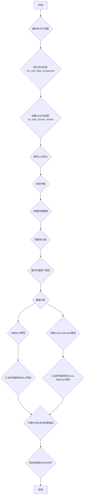

# 真实数据交叉注意力演示程序工作流程 (`real_data_cross_attention_demo_v2.py`)

本文档旨在详细解释 `real_data_cross_attention_demo_v2.py` 脚本的执行流程。该脚本的核心目标是，利用 `ZeroED` 系统预处理的结果，对比一个传统的多层感知机（MLP）模型和一个基于交叉注意力的（Cross Attention）模型在数据错误检测任务上的性能。

## 整体流程图



## 详细步骤解析

### 1. 启动与参数解析

程序从 `if __name__ == "__main__":` 代码块开始执行。它使用 `argparse` 模块来接收一个命令行参数 `--dataset`，用于指定需要处理的数据集名称。

```python:real_data_cross_attention_demo_v2.py
if __name__ == "__main__":
    parser = argparse.ArgumentParser(
        description="Run Cross Attention vs MLP comparison using ZeroED results"
    )
    parser.add_argument(
        '--dataset',
        type=str,
        default='beers',
        help='Dataset name (beers, hospital, flights, rayyan, etc.)'
    )

    args = parser.parse_args()
    results = run_real_data_comparison(dataset_name=args.dataset)
```

### 2. 运行对比实验 (`run_real_data_comparison`)

这是整个脚本的主函数，负责协调所有步骤。

#### 2.1 加载ZeroED结果

实验的第一步是从磁盘加载 `ZeroED` 预处理后的结果。脚本会自动查找最新的结果目录。`ZeroED` 的结果是整个流程的数据基础，包含了专业特征、聚类信息和大型语言模型（LLM）的标注。

```python:real_data_cross_attention_demo_v2.py
def run_real_data_comparison(dataset_name="beers"):
    # ...
    LOGGER.info("\n1. Loading ZeroED results...")
    
    # 动态查找最新的ZeroED结果目录
    base_result_dir = "/data/nw/Cleaning_LLM/result/pipeline"
    # ...
    # 查找并确定最新的结果路径 resp_path
    
    zeroed_results = try_load_zeroed_results(resp_path, dataset_name)
    # ...
```

### 3. 数据加载与预处理 (`try_load_zeroed_results`)

这个函数是数据准备的核心，它严格遵循 `ZeroED` 项目的数据处理逻辑。

#### 3.1 加载核心文件

函数首先加载三个关键文件：
- `cluster_index_dict.json`: 包含了数据聚类的索引信息。
- `center_value_dict.json`: 包含了每个聚类中心的值。
- `cluster_feat_dict.pkl`: 包含了为每个数据点提取的专业特征。

#### 3.2 解析LLM标注

接下来，脚本读取 `error_checking/` 目录下的文本文件，这些文件记录了LLM对数据样本的判断（正确或错误）。脚本使用正则表达式从这些文本中提取出被LLM标记为“错误”和“正确”的数据值。

```python:real_data_cross_attention_demo_v2.py
def err_pat_in_text_attr(attr):
    pattern = fr'"value_row":\s*(".*?"),\s*\n\s*"error_analysis":\s*"[^"]*",\s*\n\s*"has_error_in_{attr}_value":\s*true'
    return pattern

# ...

# 提取错误值
wrong_pattern = err_pat_in_text_attr(attr)
matches = re.finditer(wrong_pattern, content)
wrong_values = [match.group(1).replace("':'", "': '")... for match in matches]
```

#### 3.3 标签传播

LLM只标注了聚类的中心点。为了给所有数据点打上标签，脚本执行“标签传播”：如果一个聚类中心被标记为错误，那么该聚类中的所有数据点都被标记为错误，反之亦然。

```python:real_data_cross_attention_demo_v2.py
# 标签传播（使用ZeroED/main.py中的label_prop逻辑）
det_wrong_list = []
det_right_list = []

for attr, clusters in cluster_index_dict.items():
    # ...
    # 查找中心点的标签
    # ...
    # 将标签传播到整个簇
    if temp_label == 0:
        for index in temp_cluster:
            det_right_list.append((index, attr, 0))
    elif temp_label == 1:
        for index in temp_cluster:
            det_wrong_list.append((index, attr, 1))
```

#### 3.4 构建训练数据集

最后，函数将 `ZeroED` 提供的专业特征 (`occur_cnt_feat`, `pat_stats_feat`, etc.) 和传播后的标签（0表示正确，1表示错误）结合起来，构建最终的训练数据集。数据按原始表格的属性（列）进行分组。

```python:real_data_cross_attention_demo_v2.py
# 构建训练数据
# ...
for row_idx, attr, label in det_right_list + det_wrong_list:
    # ...
    if (row_idx, col_idx) in feature_all_dict:
        feat_dict = feature_all_dict[(row_idx, col_idx)]
        
        # 组合所有特征
        feature_parts = []
        # ...
        
        # 添加到对应属性的组
        attr_groups[attr]['features'].append(np.array(feature_parts))
        attr_groups[attr]['labels'].append(label)
        # ...
```

### 4. 模型训练与评估

回到 `run_real_data_comparison` 函数，脚本现在有了按属性分组的、带标签的特征数据。

#### 4.1 按属性循环训练

脚本会遍历每一个属性（数据列），为每一个属性单独训练和评估模型。

```python:real_data_cross_attention_demo_v2.py
for attr_name, attr_data in attr_groups.items():
    LOGGER.info(f"\n  Processing attribute: {attr_name}")
    
    # ...
    
    # 分割数据
    X_train, X_test, y_train, y_test, texts_train, texts_test = train_test_split(...)
    
    # 训练MLP
    # ...
    
    # 训练Cross Attention
    # ...
```

#### 4.2 训练MLP基线模型

对于每个属性，脚本首先使用 `sklearn` 的 `MLPClassifier` 训练一个标准的MLP模型，并记录其在测试集上的预测结果。

```python:real_data_cross_attention_demo_v2.py
mlp = MLPClassifier(
    hidden_layer_sizes=(128, 64),
    # ...
)
mlp.fit(X_train, y_train)
mlp_preds = mlp.predict(X_test)
```

#### 4.3 训练Cross Attention模型

然后，脚本使用自定义的 `LLMBasedCrossAttentionDetector` 模块训练交叉注意力模型。这个模型不仅使用专业特征，还利用了包含上下文信息的文本描述（例如 "The value '...' in column '...' is incorrect"）。

```python:real_data_cross_attention_demo_v2.py
detector = LLMBasedCrossAttentionDetector(
    model_name="/data/nw/modelscope_models/Qwen2.5-1.5B-Instruct",
    device="cuda"
)
# ...
detector.train(
    train_features=X_train,
    train_labels=y_train,
    train_texts=texts_train,
    # ...
)
cross_attn_preds = detector.predict(X_test, texts_test)
```

### 5. 结果汇总与对比

在所有属性都处理完毕后，脚本将各个属性的测试结果汇总起来。

#### 5.1 计算总体性能指标

脚本计算两个模型在所有属性上的总体准确率（Accuracy）、精确率（Precision）、召回率（Recall）和F1分数（F1-Score）。这些指标可以全面地衡量模型的错误检测能力。

```python:real_data_cross_attention_demo_v2.py
# 汇总结果
all_labels = np.array(all_labels)
all_mlp_preds = np.array(all_mlp_preds)
all_cross_attn_preds = np.array(all_cross_attn_preds)

# ...

# 对比结果
overall_mlp_acc = accuracy_score(all_labels, all_mlp_preds)
mlp_precision = precision_score(all_labels, all_mlp_preds, pos_label=1)
# ...
overall_cross_attn_acc = accuracy_score(all_labels, all_cross_attn_preds)
# ...
```

#### 5.2 保存结果

最后，所有配置、性能指标和对比结果被保存在一个JSON文件中，以便后续分析。

```python:real_data_cross_attention_demo_v2.py
output_file = f"/data/nw/Cleaning_LLM/real_data_comparison_v2_{dataset_name}.json"
with open(output_file, 'w') as f:
    json.dump(results, f, indent=2)

LOGGER.info(f"\n✓ Results saved to {output_file}")
```

至此，整个脚本执行完毕。
