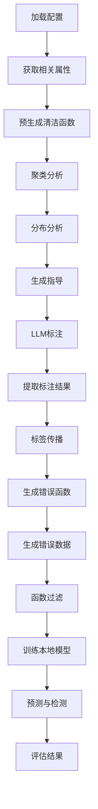

# ZeroED: Hybrid Zero-Shot Error Detection System - 详细技术文档

## 1. 项目概述

### 1.1 系统简介

ZeroED是一个混合零样本表格数据错误检测系统，它利用大语言模型(LLM)的推理能力来进行数据质量检测。该系统是论文"ZeroED: Hybrid Zero-Shot Error Detection with Large Language Model Reasoning"的官方实现。

**核心特性：**
- 🚀 **零样本学习**：无需标注数据即可检测多种类型的错误
- 🤖 **LLM增强**：结合传统ML算法与LLM的推理能力
- 🔍 **多维度检测**：支持6种主要错误类型检测
- 📊 **自动化管道**：端到端的自动化检测流程
- ⚡ **高性能**：支持并行处理和多进程加速

### 1.2 支持的错误类型

1. **Pattern Violations（模式违规）**：格式不符合预期
2. **Missing Values（缺失值）**：显式或隐式的空值
3. **Constraint Violations（约束违规）**：违反业务规则或属性间关系
4. **Out-of-domain Values（域外值）**：超出有效范围或集合
5. **Typos（拼写错误）**：输入时的拼写或录入错误
6. **Common Knowledge Violations（常识违规）**：违反常识或事实

## 2. 系统架构

### 2.1 整体架构图

```
┌─────────────────────────────────────────────────────────────────┐
│                    ZeroED Hybrid System                        │
├─────────────────┬─────────────────┬─────────────────────────────┤
│   Traditional ML │   +   │   LLM + RAG   │   =   │  Hybrid System │
│   - Clustering   │         │ - Prompt Gen  │         │  - Detection  │
│   - Features     │         │ - Reasoning   │         │  - Evaluation │
│   - ML Models    │         │ - Guidelines  │         │  - Results    │
└─────────────────┴─────────────┴─────────────┴─────────────────────┘
```

### 2.2 核心模块组成

```
ZeroED/
├── main.py                 # 主控制模块 - 管道调度
├── feature.py              # 特征工程与聚类
├── measure.py              # 评估指标计算
├── prompt_gen.py           # 提示词生成
├── distri_analys.py        # 数据分布分析
├── get_rel_attrs.py        # 相关属性计算
├── utility.py              # 工具函数
├── tools/                  # 辅助工具
│   ├── err_type_det.py     # 错误类型检测
│   ├── err_type_select.py  # 错误类型选择
│   ├── read_results.py     # 结果读取
│   └── ...
├── run_config.yaml         # 运行配置
└── README.md              # 项目说明
```

## 3. 核心模块详解

### 3.1 main.py - 主控制模块

**作用**：作为系统的核心调度器，协调整个检测流程

**主要功能：**

#### 3.1.1 配置管理
- 从YAML配置文件加载所有参数
- 管理模型配置、读取配置、数据配置
- 动态生成结果路径

```python
# 配置示例
model:
  api_use: false
  pre_func_use: true
  related_attrs: true
  distri_analysis: true
  guide_use: true
  func_use: true
  n_method: '5%'  # 聚类数量方法
  err_gen_use: true
  rel_top: 2  # 相关属性数量
```

#### 3.1.2 管道步骤调度

1. **获取相关属性** (`process_related_attr`)
   - 计算属性间的互信息(NMI)
   - 识别强相关属性对
   - 生成相关属性字典

2. **预生成函数** (`process_gen_clean_funcs`)
   - 使用LLM生成初步清洁判断函数
   - 为每个属性生成基础检测规则

3. **聚类分析** (`process_cluster`)
   - 使用多种聚类算法(KMeans, DBSCAN, Agglomerative)
   - 降维处理和特征生成
   - 生成聚类中心和标签

4. **分布分析** (`process_distri_analys`)
   - LLM分析数据分布特征
   - 生成属性级别的领域知识
   - 为后续检测提供上下文

5. **生成指导** (`process_guidlines`)
   - 基于分布分析生成检测指南
   - 提供错误类型识别规则

6. **LLM标注** (`process_error_checking`)
   - 对聚类中心进行错误检测
   - 提取LLM标注结果
   - 标签传播到整个数据集

7. **函数生成** (`process_gen_err_funcs`)
   - 基于标注数据生成专用检测函数
   - 迭代优化和过滤

8. **错误数据生成** (`process_gen_err_data`)
   - 生成额外的错误样本
   - 增强训练数据

9. **模型训练** (`train_model`)
   - 使用MLPClassifier训练本地模型
   - 多属性并行训练

10. **预测与评估** (`make_predictions`)
    - 对所有数据进行错误预测
    - 计算precision、recall、F1

### 3.2 feature.py - 特征工程与聚类

**作用**：负责特征构建、聚类分析和数据预处理

**核心功能：**

#### 3.2.1 共现统计 (count_attribute_value_pairs)
```python
def count_attribute_value_pairs(csv_filepath):
    # 统计属性值对的出现频率
    # 计算属性间的共现关系
    # 返回attr_val_dict和co_occur_dict
```

- 并行处理提高效率
- 处理空值('nan')标准化
- 构建共现矩阵

#### 3.2.2 字符串聚合函数

提供4级字符串抽象：

1. **L1_str_agg**：符号长度抽象
   ```python
   'hello123' → '\\A-5'
   ```

2. **L2_str_agg**：字符类型聚合
   ```python
   'hello123' → '\\L-5\\D-3'
   ```

3. **L3_str_agg**：更细粒度类型分类
   ```python
   'Hello123!' → '\\Lu-1\\Ll-4\\D-3\\S-1'
   ```

4. **str_agg**：综合所有抽象级别
   ```python
   返回：[原始值, L3, L2, L1]
   ```

#### 3.2.3 特征生成 (feat_gen)

**多维特征组合：**

1. **共现计数特征**
   - 当前值与其他属性值的共现频率
   - 基于上下文的相关性度量

2. **模式统计特征**
   - 字符串模式在属性中的分布
   - 模式匹配成功率

3. **FastText嵌入特征**
   - 预训练词向量表示
   - 降维处理(默认300维)
   - 组合相关属性向量

4. **预函数特征**
   - 预生成的清洁判断函数结果
   - 多角度规则匹配

**特征工程流程：**
```python
feature = [
    occur_cnt_feat,      # 共现计数
    pat_stats_feature,   # 模式统计
    fasttext_vector,     # 词向量
    pre_funcs_feat       # 预函数特征
]
```

#### 3.2.4 聚类算法 (cluster)

**支持的聚类方法：**

1. **KMeans**
   - 基于质心的经典聚类
   - 自动确定簇数量(数据行数的5%)

2. **DBSCAN**
   - 基于密度的聚类
   - 自动发现噪声点
   - 不需要预先指定簇数量

3. **Agglomerative Clustering**
   - 层次化聚类
   - 自底向上的合并策略

4. **RANDOM**
   - 随机基线方法
   - 用于对比实验

**聚类输出：**
- `center_list`：每个簇的质心索引
- `clusters`：所有簇的成员索引
- `val_feat_dict`：值到特征的映射

### 3.3 prompt_gen.py - 提示词工程

**作用**：生成高质量的LLM提示词，引导模型进行数据质量分析

**核心提示词模板：**

#### 3.3.1 错误检测提示 (error_check_prompt)

```python
def error_check_prompt(col_values, col_name):
    """
    生成JSON格式的错误检测提示
    要求LLM分析特定属性的错误
    """
```

**特点：**
- JSON结构化输出
- 明确标注错误/正确
- 提供错误分析理由
- 支持批量检测

#### 3.3.2 错误生成提示 (create_err_gen_inst_prompt)

```python
def create_err_gen_inst_prompt(clean_vals, dirty_vals, target_attribute):
    """
    生成错误样本创建提示
    要求LLM基于clean/dirty样本生成新错误
    """
```

**覆盖的错误类型：**
1. Pattern Violations
2. Missing Values
3. Constraints Violations
4. Out-of-domain values
5. Typos
6. Common Knowledge Violations

#### 3.3.3 预函数生成提示 (pre_func_prompt)

```python
def pre_func_prompt(attr_name, data_example):
    """
    生成预清洁函数创建提示
    要求LLM生成初步判断函数
    """
```

**函数规范：**
- 函数名：`is_clean_[judgment]`
- 输入：`(row, attr)`
- 输出：`True/False`
- 覆盖多个判断角度

#### 3.3.4 清洁函数生成提示 (err_clean_func_prompt)

```python
def err_clean_func_prompt(attr_name, clean_info, errs_info):
    """
    基于clean/err样本对生成精确判断函数
    """
```

**对比学习策略：**
- 分析clean和dirty差异
- 生成互补判断规则
- 提升分类准确性

#### 3.3.5 指南生成提示 (kb_gen_prompt)

```python
def kb_gen_prompt(attr_name, dataset_name, idx_list, dirty_csv, attr_analy_content):
    """
    生成领域知识指南
    为特定属性提供专业错误检测规则
    """
```

**指南内容：**
1. 属性语义解释
2. 错误类型详述
3. 6类错误的具体检测方法
4. 常见错误示例

### 3.4 distri_analys.py - 数据分布分析器

**作用**：使用LLM分析数据的分布特征，生成领域知识

**核心类：LLMDataDistrAnalyzer**

#### 3.4.1 分析视角

每个分析函数从特定角度理解数据：

1. **值分布分析**
   - 唯一值统计
   - 频率分布
   - 代表性样本

2. **类型分析**
   - 数据类型推断
   - 格式模式识别
   - 结构特征

3. **语义分析**
   - 领域相关性
   - 业务规则
   - 常识约束

#### 3.4.2 函数执行流程

```python
def analyze_data(self, attr_name, llm_response, output_file):
    # 1. 提取函数
    functions = extract_func(llm_response)

    # 2. 验证语法
    clean_code = self.validate_and_clean_function(func_code)

    # 3. 安全执行
    result = self.execute_function(clean_code, attr_name)

    # 4. 记录结果
    with open(output_file, 'a') as f:
        f.write(f"**Running Results:**\n{result}\n")
```

**安全保障：**
- AST语法验证
- 隔离命名空间
- 异常捕获与处理

### 3.5 get_rel_attrs.py - 相关属性计算

**作用**：计算属性间的相关性，识别强相关属性对

**核心指标：互信息(MI)和标准化互信息(NMI)**

#### 3.5.1 算法流程

1. **互信息计算**
   ```python
   def cal_mutual_information(col1, col2):
       # 过滤空值
       mask = (col1 != 'nan') & (col2 != 'nan')
       # 计算互信息
       return mutual_info_score(col1[mask], col2[mask])
   ```

2. **熵计算**
   ```python
   def cal_entropy(column):
       # 计算概率分布
       probabilities = counts / len(column)
       # 信息熵
       return -sum(p * np.log2(p) for p in probabilities if p > 0)
   ```

3. **NMI计算**
   ```python
   def cal_nmi(column1, column2):
       # 2 * MI / (H(X) + H(Y))
       return 2 * mi / (entropy1 + entropy2)
   ```

4. **选择强相关属性**
   ```python
   def cal_strong_res_column_nmi(nmi_results, rel_top=1):
       # 选择top-K相关属性
       sorted_cols = sorted(related_cols.items(), key=lambda x: x[1], reverse=True)
       top_results[col1] = dict(sorted_cols[:rel_top])
   ```

**优势：**
- 识别属性依赖关系
- 减少特征冗余
- 提升检测准确性
- 支持领域知识发现

### 3.6 measure.py - 评估模块

**作用**：计算检测结果的性能指标，支持细粒度评估

#### 3.6.1 核心指标

```python
def measure_detect(clean_path, dirty_path_ori, detect_list, res_path):
    # 计算TP, FP, FN
    correctly_detect = len(TP)  # 正确检测的错误
    wrongly_detect = len(FP)    # 误报
    all_need_detect = len(TN+FN) # 所有错误

    # 计算指标
    precision = correctly_detect / (all_detected + 1e-8)
    recall = correctly_detect / (all_need_detect + 1e-8)
    f1 = 2 * pre * rec / (pre + rec + 1e-8)
```

#### 3.6.2 细粒度分析

**按属性统计：**
- 每个属性的错误数量
- 误报率分析
- 漏报率分析

**错误详情记录：**
```python
results += '\nwrongly_detect:\n'
# 记录误报详情

results += '\nmissing_errors:\n'
# 记录漏报详情
```

### 3.7 utility.py - 工具函数库

**核心组件：**

#### 3.7.1 Timer类 - 性能监控
```python
class Timer:
    def __enter__(self):
        self.start = time.time()
        self.logger.info(f'{self.name}......')
        return self

    def __exit__(self, exc_type, exc_val, exc_tb):
        self.duration = self.end - self.start
        # 记录执行时间
        self.time_file.write(f"{self.name}: {self.duration}\n")
```

#### 3.7.2 Logger类 - 日志管理
```python
class Logger:
    def __init__(self, resp_path):
        # 控制台和文件双重输出
        console_handler = logging.StreamHandler()
        file_handler = logging.FileHandler(os.path.join(resp_path, 'run.log'))
```

#### 3.7.3 LLM接口 (get_ans_from_llm)

**两种调用模式：**

1. **本地模式** (api_use=False)
   - 使用本地部署的LLM
   - 默认端点：http://localhost:8000/v1
   - 默认模型：qwen2.5-72bs-instruct

2. **API模式** (api_use=True)
   - 使用云端API服务
   - 支持多API密钥轮询
   - 指数退避重试策略

```python
def get_ans_from_llm(prompt, api_use=False):
    if not api_use:
        # 本地模式 - 无API key
        client = OpenAI(api_key="EMPTY", base_url="http://localhost:8000/v1")
    elif api_use:
        # API模式 - 轮询API keys
        for key_idx in range(len(api_key_list)):
            try:
                client = OpenAI(api_key=api_key_list[key_idx], ...)
                # 发送请求
            except Exception as e:
                # 指数退避
                sleep_time = base_sleep * (2 + try_cnt)
                time.sleep(sleep_time)
```

**重试机制：**
- 最大重试次数：200次
- 指数退避策略
- 多密钥故障转移
- 超时保护

#### 3.7.4 RAG查询 (rag_query)
```python
def rag_query(query, documents, GPT_USE=True):
    # 基于检索增强生成
    response = get_ans_from_llm(f"Question: {query}\n\n Guidelines:{documents}")
    return response
```

#### 3.7.5 工具函数

- `split_list_to_sublists`：列表分片
- `default_dict_of_lists`：默认字典工厂
- `copy_read_files_in_dir`：目录复制
- `get_read_paths`：批量路径解析

## 4. 完整工作流程

### 4.1 端到端执行流程



### 4.2 详细步骤说明

#### 阶段1：初始化与准备

**步骤1：加载配置 (main.py:768-816)**
- 解析YAML配置文件
- 创建结果目录
- 记录配置参数

**步骤2：相关属性分析 (main.py:873-875)**
```python
related_attrs_dict, gt_wrong_dict = process_related_attr(
    RELATED_ATTRS, RELATED_ATTRS_READ, REL_TOP, read_path,
    resp_path, clean_csv, dirty_csv, all_attrs
)
```
- 计算所有属性对的NMI
- 选择top-K相关属性
- 构建相关属性图

#### 阶段2：特征工程

**步骤3：预函数生成 (main.py:878-880)**
```python
pre_funcs_for_attr = process_gen_clean_funcs(
    PRE_FUNC_USE, PRE_FUNC_READ, read_pre_func_path,
    funcs_pre_directory, dirty_csv, all_attrs, related_attrs_dict, logger
)
```
- 为每个属性生成初步清洁函数
- 使用LLM理解数据模式
- 建立基础检测规则

**步骤4：聚类与特征生成 (main.py:884-886)**
```python
cluster_index_dict, center_value_dict, feature_all_dict = process_cluster(
    n_method, CLUSTER_READ, dataset, read_path, resp_path,
    dirty_csv, all_attrs, related_attrs_dict, pre_funcs_for_attr
)
```
- 多种聚类算法可选
- 生成多维特征
- 提取代表性样本

**特征维度：**
- 共现计数：`|attrs|` 维
- 模式统计：4维(L1-L3+原始)
- FastText嵌入：`|attrs| * 300` 维
- 预函数特征：动态维度

#### 阶段3：知识构建

**步骤5：数据分布分析 (main.py:889-891)**
```python
distri_analy_content = process_distri_analys(
    DISTRI_ANALYSIS, DISTRI_ANALYSIS_READ, read_path,
    resp_path, dirty_csv, all_attrs
)
```
- LLM分析数据分布
- 生成领域知识
- 理解属性语义

**步骤6：指南生成 (main.py:894-896)**
```python
guide_content = process_guidlines(
    GUIDE_USE, GUIDE_READ, dataset, read_path, read_guide_path,
    resp_path, dirty_csv, all_attrs, guide_directory,
    cluster_index_dict, distri_analy_content
)
```
- 基于分布分析生成指南
- 6类错误的详细规则
- 为LLM提供上下文

#### 阶段4：标注与传播

**步骤7：LLM标注 (main.py:898-900)**
```python
process_error_checking(
    ERROR_CHECKING_READ, read_error_checking_path,
    all_attrs, error_checking_res_directory
)
```
- 对聚类中心进行标注
- JSON结构化输出
- 包含错误理由

**步骤8：提取标注结果 (main.py:903-905)**
```python
center_index_value_label_dict = extract_llm_label_res(
    all_attrs, error_checking_res_directory,
    cluster_index_dict, center_value_dict
)
```
- 正则表达式解析JSON
- 处理冲突标注
- 生成(索引, 值, 标签)三元组

**步骤9：评估LLM标注 (main.py:908-910)**
```python
measure_status = measure_llm_label(
    resp_path, clean_csv, all_attrs,
    related_attrs_dict, gt_wrong_dict, center_index_value_label_dict
)
```
- 计算标注准确性
- 记录误标和漏标
- 生成评估报告

**步骤10：标签传播 (main.py:914-916)**
```python
det_wrong_list, det_right_list = label_prop(
    resp_path, dirty_path, clean_path,
    cluster_index_dict, center_index_value_label_dict
)
```
- 将中心点标签传播到簇内
- 生成训练数据
- 构建正负样本

#### 阶段5：函数优化

**步骤11：错误函数生成 (main.py:919-921)**
```python
err_gen_dict, funcs_for_attr = process_gen_err_funcs(
    FUNC_USE, FUNC_READ, read_path, read_func_path,
    read_error_path, resp_path, funcs_directory,
    dirty_csv, all_attrs, para_file, related_attrs_dict,
    center_index_value_label_dict, det_wrong_list, det_right_list
)
```

**函数过滤流程：**

1. **基于右样本过滤** (main.py:956-965)
```python
for func in funcs_for_attr[attr]['clean']:
    pass_num = 0
    for val in init_det_right_dict[attr]:
        if handle_func_exec(func, val[1], attr) == 1:
            pass_num += 1
    if float(pass_num / len(init_det_right_dict[attr])) < 0.5:
        funcs_for_attr[attr]['clean'].remove(func)
```

2. **基于左样本过滤** (main.py:968-976)
```python
for val in init_det_right_dict[attr]:
    pass_num = sum(handle_func_exec(func, val[1], attr)
                   for func in funcs_for_attr[attr]['clean'])
    if pass_num / (len(funcs_for_attr[attr]['clean'])+1e-6) < 0.5:
        det_right_list.remove((val[0], attr))
```

3. **最终过滤** (main.py:978-990)
```python
for func in funcs_for_attr[attr]['clean']:
    pass_num = sum(handle_func_exec(func, val, attr)
                   for val in llm_label_vals_dict[attr]['right_val_values'])
    if float(pass_num / val_num) >= 0.5:
        temp_func_list.append(func)
funcs_for_attr[attr]['clean'] = temp_func_list
```

**步骤12：错误数据生成 (main.py:923-926)**
```python
process_gen_err_data(
    ERR_GEN_USE, ERR_GEN_READ, read_err_gen_path,
    err_gen_directory, dirty_csv, all_attrs,
    related_attrs_dict, center_index_value_label_dict, err_gen_dict, logger
)
```

#### 阶段6：模型训练

**步骤13：训练数据准备 (main.py:1005-1016)**
```python
feat_dict_train = {}
label_dict_train = {}

with mp.Pool() as feat_pool:
    for attr in all_attrs:
        result = feat_pool.apply_async(process_attr_train_feat, args=(
            attr, dirty_csv, det_right_list, det_wrong_list,
            related_attrs_dict, err_gen_dict, funcs_for_attr,
            feature_all_dict, resp_path
        ))
        results.append(result)
```

**特征维度计算：**
```python
def single_val_feat(val, fasttext_m, funcs_for_attr, attr, idx, all_attrs):
    feature = [
        handle_func_exec(func, val, attr)   # 预函数特征
        for func in funcs_for_attr[attr]['clean']
    ]
    # 添加FastText向量
    for a_val in val.values():
        feature.extend(fasttext_m.get_word_vector(str(a_val)))
    return feature
```

**步骤14：模型训练 (main.py:1020-1023)**
```python
for attr in tqdm(all_attrs, desc="Training models", ncols=120):
    attr, model, learning_rate, optimizer, model_str, epoch = train_model(
        attr, feat_dict_train[attr], label_dict_train[attr], num_epochs
    )
    if model is not None:
        model_col[attr] = model
```

**MLPClassifier配置：**
```python
MLPClassifier(
    hidden_layer_sizes=(2 * input_dim, input_dim),  # 两层隐藏层
    activation='relu',
    solver='adam',
    max_iter=num_epochs,
    random_state=42,
    n_iter_no_change=10,
    verbose=True
)
```

#### 阶段7：预测与评估

**步骤15：预测 (main.py:1029-1033)**
```python
for col, attr in tqdm(enumerate(all_attrs), desc="Making predictions", ncols=120):
    wrong_cells = make_predictions(
        col, attr, dirty_csv, model_col,
        related_attrs_dict, funcs_for_attr, feature_all_dict, resp_path
    )
    for cell in wrong_cells:
        if cell not in det_wrong_list:
            det_wrong_list.append(cell)
```

**步骤16：评估 (main.py:1035-1036)**
```python
det_res_path = os.path.join(resp_path, "func_det_res.txt")
measure_detect(clean_path, dirty_path, list(det_wrong_list), det_res_path)
```

## 5. 关键技术特性

### 5.1 混合智能架构

**传统ML + LLM的优势：**

1. **数据效率**：无需大量标注数据
2. **泛化能力**：零样本检测新错误类型
3. **可解释性**：LLM提供错误理由
4. **鲁棒性**：ML模型提供稳定性

### 5.2 创新点

#### 5.2.1 零样本检测
- 无需预定义错误模式
- 自动发现潜在错误
- 支持未见过的错误类型

#### 5.2.2 多层次特征
- **语法层**：字符串模式、统计特征
- **语义层**：FastText嵌入、领域知识
- **规则层**：LLM生成函数、预定义规则

#### 5.2.3 自适应管道
- 模块化设计，各模块可独立配置
- 支持读取中间结果，避免重复计算
- 批处理模式支持大规模数据

### 5.3 性能优化

#### 5.3.1 并行化策略

**多进程：**
```python
# 聚类阶段
with multiprocessing.Pool(len(all_attrs)) as pool:
    results = [pool.apply_async(cluster, args=(...)) for col in range(len(all_attrs))]

# 特征生成阶段
with ThreadPoolExecutor(max_workers=256) as executor:
    futures = [executor.submit(single_val_feat, ...) for idx in range(len(dirty_csv))]
```

**多线程：**
```python
# LLM查询阶段
with ThreadPoolExecutor(max_workers=2*os.cpu_count()) as executor:
    results = [executor.submit(task_func_gen, attr, err_gen_dict) for attr in all_attrs]
```

#### 5.3.2 内存优化

1. **特征字典管理**：pickle序列化存储特征
2. **批量处理**：分批加载数据
3. **中间结果缓存**：避免重复计算

#### 5.3.3 LLM接口优化

**重试机制：**
- 指数退避：`(base_sleep * (2 + try_cnt))`
- 最大重试：200次
- 多密钥轮询

**批处理查询：**
```python
split_center_values = split_list_to_sublists(df_center_idx, err_check_val_num_per_query)
```

## 6. 配置详解

### 6.1 模型配置 (model)

```yaml
model:
  api_use: false                    # 是否使用API模式
  pre_func_use: true               # 是否生成预函数
  related_attrs: true              # 是否计算相关属性
  distri_analysis: true            # 是否进行分布分析
  guide_use: true                  # 是否生成指南
  func_use: true                   # 是否生成错误函数
  n_method: '5%'                   # 聚类数量方法(百分比或具体数值)
  err_gen_use: true                # 是否生成错误数据
  rel_top: 2                       # 相关属性数量
  run_info: '运行说明'             # 运行信息描述
```

**n_method选项：**
- `'5%'`：聚类数为数据行的5%
- 整数：固定聚类数
- `'10%'`：聚类数为数据行的10%

### 6.2 读取配置 (read)

```yaml
read:
  pre_func: true                   # 是否读取预函数文件
  distri_analysis: true            # 是否读取分布分析结果
  related_attrs: true              # 是否读取相关属性
  cluster: true                    # 是否读取聚类结果
  guide: true                      # 是否读取指南
  error_checking: true             # 是否读取错误检查结果
  func: true                       # 是否读取函数文件
  err_gen: true                    # 是否读取错误生成结果
  read_in_batch: true              # 是否批量读取
  start_time: '02-14-19:32'        # 批量读取开始时间
  end_time: '02-14-22:23'          # 批量读取结束时间
```

**使用建议：**
- 首次运行：全部设为`false`
- 调试阶段：可设为`true`读取之前结果
- 批量模式：设置时间范围自动匹配结果

### 6.3 数据配置 (data)

```yaml
data:
  base_dir: '.'                    # 基础目录
  err_rate_list:                   # 错误类型列表
    - "mixed_err"
    - "typos"
    - "missing_values"
    - "pattern_violations"
    - "rule_violations"
    - "outliers"
  all_set_num: 5                   # 数据集版本数
  datasets: ['beers']              # 数据集列表
  err_check_val_num_per_query: 20  # LLM查询时的值数量
  result_dir: 'pipeline'           # 结果目录名
```

**数据集命名规范：**
```
{ dataset }_{ clean | error-{err_rate} }.csv
例如：
- beers_clean.csv
- beers_error-mixed_err.csv
```

### 6.4 读取路径 (read_paths)

```yaml
read_paths:
  flights01-1: './result/pipeline/02-08 flights01-5%-set1/'
  flights01-2: './result/pipeline/02-08 flights01-5%-set2/'
  ...
```

**自动路径生成：**
```python
read_path = f"{base_dir}/result/{result_dir}/{date_time} {dataset}{err_rate}-{n_method}-set{set_num}"
# 例如：./result/pipeline/02-14 beers01-5%-set1
```

## 7. 使用指南

### 7.1 环境准备

```bash
# 1. 创建虚拟环境
conda create -n zeroed python=3.10
conda activate zeroed

# 2. 克隆仓库
git clone https://github.com/WelkinNi/ZeroED.git
cd ZeroED

# 3. 安装依赖
pip install -r requirements.txt

# 4. 下载FastText模型
wget https://dl.fbaipublicfiles.com/fasttext/vectors-english/cc.en.300.bin.gz
gunzip cc.en.300.bin.gz
```

**核心依赖：**
```txt
torch>=1.9.0
transformers>=4.20.0
fasttext>=0.9.2
pandas>=1.3.0
numpy>=1.21.0
scikit-learn>=1.0.0
tqdm>=4.60.0
pyyaml>=6.0
openai>=0.27.0
kneed>=0.7.0
sentence-transformers>=2.2.0
```

### 7.2 数据准备

**目录结构：**
```
data/
├── {dataset}_clean.csv           # 清洁数据(Ground Truth)
└── {dataset}_error-{type}.csv    # 污染数据
```

**数据要求：**
- CSV格式
- UTF-8编码
- 首行为列名
- 字符串类型(自动转换)

### 7.3 LLM配置

#### 7.3.1 本地模式

修改`utility.py` (第92-118行)：
```python
def get_ans_from_llm(prompt, api_use=False):
    if not api_use:
        openai_api_key = "EMPTY"
        openai_api_base = "http://localhost:8000/v1"  # 你的本地API地址
        model_name = "./qwen2.5-72bs-instruct"       # 你的本地模型路径
```

#### 7.3.2 API模式

修改`utility.py` (第121-164行)：
```python
elif api_use:
    model_type='qwen2.5-7b-instruct'  # API模型名
    api_key_list = [
        'your-api-key-1',
        'your-api-key-2',
        # 更多keys
    ]
```

### 7.4 运行系统

```bash
# 标准运行
python main.py --config run_config.yaml

# 自定义配置
python main.py --config my_config.yaml
```

### 7.5 结果解释

**输出目录结构：**
```
result/pipeline/{date} {dataset}{err_rate}-{n_method}-set{num}/
├── 0-parameters.txt              # 运行参数
├── 0-time.txt                    # 各阶段耗时
├── run.log                       # 详细日志
├── func_det_res.txt              # 最终检测结果
├── related_attrs_dict.json       # 相关属性
├── cluster_index_dict.json       # 聚类索引
├── center_value_dict.json        # 聚类中心值
├── cluster_feat_dict.pkl         # 特征字典
├── guide/                        # 生成的指南
│   ├── guide_{attr}.txt
│   └── prompt_{attr}.txt
├── error_checking/               # LLM标注结果
│   └── error_checking_{attr}.txt
├── funcs/                        # 生成函数
│   └── funcs_zgen_{attr}.txt
└── distri_analys/                # 分布分析
    ├── distri_analys_{attr}.txt
    └── prompt_distri_analys_{attr}.txt
```

**func_det_res.txt内容：**
```
all_wrong_num: 150                # 真实错误数
all_detected_num: 120             # 检测到的错误数
correctly_detect: 100             # 正确检测数
pre: 0.8333                       # Precision = 100/120
rec: 0.6667                       # Recall = 100/150
f1: 0.7407                       # F1 = 2*0.8333*0.6667/(0.8333+0.6667)

# 详细误报和漏报
```

## 8. 高级用法

### 8.1 批处理模式

**配置批处理：**
```yaml
read:
  read_in_batch: true
  start_time: '02-14-19:32'
  end_time: '02-14-22:23'
```

**自动匹配结果：**
- 基于时间戳匹配历史结果
- 支持增量式管道执行
- 避免重复计算

### 8.2 多数据集并行

```yaml
data:
  datasets: ['beers', 'flights', 'movies']
  err_rate_list: ["01", "05", "10"]
  all_set_num: 5
```

**结果组合：**
```python
for set_num, dataset in zip(set_num_list, dataset_list):
    for err_rate in err_rate_list:
        # 处理每个组合
```

### 8.3 自定义错误类型

1. **添加新类型**到`run_config.yaml`：
```yaml
data:
  err_rate_list: ["my_new_error_type"]
```

2. **准备数据**：
```bash
data/beers_clean.csv
data/beers_error-my_new_error_type.csv
```

3. **运行系统**：
```bash
python main.py --config run_config.yaml
```

### 8.4 性能调优

#### 8.4.1 聚类优化

```yaml
model:
  n_method: '3%'  # 减少聚类数，提高速度
```

**算法选择：**
```python
# feature.py:272-344
cluster_method = 'RANDOM'  # 最快
cluster_method = 'KMeans'  # 平衡
cluster_method = 'DBSCAN'  # 最精确但较慢
```

#### 8.4.2 LLM优化

**降低查询频率：**
```yaml
data:
  err_check_val_num_per_query: 50  # 每查询处理更多值
```

**启用读取模式：**
```yaml
read:
  error_checking: true  # 读取之前结果
```

#### 8.4.3 并行度调优

**调整worker数量**：
```python
# utility.py:43
max_workers = 128  # 增加CPU密集型任务
```

```python
# main.py:380
with ThreadPoolExecutor(max_workers=256) as executor:  # 增加IO密集型任务
```

### 8.5 调试模式

**启用详细日志**：
```python
# utility.py:47
self.logger.setLevel(logging.DEBUG)
```

**记录函数执行错误**：
```python
# feature.py:74-82
funcs_with_errors.add(func_str)  # 收集错误函数
# 将在日志中输出所有失败案例
```

**保存中间结果**：
```yaml
read:
  all_set_to_true  # 启用所有读取选项
```

## 9. 扩展开发

### 9.1 添加新的聚类算法

在`feature.py`中添加：
```python
elif cluster_method == 'MyCluster':
    from sklearn.cluster import MyCluster
    my_cluster = MyCluster(params)
    labels = my_cluster.fit_predict(feat)
    # 处理labels...
```

### 9.2 添加新的特征类型

在`feature.py:feat_gen_single`中添加：
```python
def feat_gen_single(...):
    feature = []
    # 现有特征
    feature.extend(occur_cnt_feat)
    feature.extend(pat_stats_feature)
    feature.extend(fasttext_list[row][col])
    feature.extend(pre_funcs_feat[row][col])

    # 新特征
    my_feature = compute_my_feature(...)
    feature.extend(my_feature)

    return feature, feat_single_dict
```

### 9.3 自定义提示词

在`prompt_gen.py`中添加新模板：
```python
def my_custom_prompt(attr_name, data_example):
    prompt = f"自定义提示词内容 for {attr_name}"
    prompt += f"数据示例: {data_example}"
    # 添加具体逻辑
    return prompt
```

### 9.4 集成新模型

在`main.py`中替换训练部分：
```python
from my_model import MyModel

def train_model(attr, feature_list, label_list, num_epochs):
    # 使用自定义模型
    model = MyModel(...)
    model.fit(feature_list, label_list)
    return attr, model, 'custom', 'custom', str(model), num_epochs
```

## 10. 常见问题

### 10.1 环境问题

**Q: FastText模型下载失败**
```bash
# 手动下载
wget https://dl.fbaipublicfiles.com/fasttext/vectors-english/cc.en.300.bin.gz
gunzip cc.en.300.bin.gz

# 或使用备用链接
wget https://github.com/facebookresearch/fastText/raw/main/pretrained-vectors.md
```

**Q: CUDA内存不足**
```yaml
model:
  # 使用CPU模式
  use_cpu: true
```

### 10.2 运行问题

**Q: LLM连接超时**
- 检查本地API服务是否启动
- 验证API地址和端口
- 增加重试次数(utility.py:162)

**Q: 聚类失败**
```python
# feature.py:282-285
n_method = int(dirty_csv.shape[0] * n_method)
if n_method > len(dirty_csv.loc[:, [col_name] + related_attrs].drop_duplicates()):
    n_clusters = len(dirty_csv.loc[:, [col_name] + related_attrs].drop_duplicates())
```
减少`n_method`或使用`DBSCAN`

**Q: 特征维度不匹配**
```python
# 检查特征生成一致性
# 确保所有路径返回相同维度
```

### 10.3 结果问题

**Q: F1分数过低**
1. 检查数据质量
2. 调整聚类参数
3. 启用更多模块(guide_use, func_use)
4. 增加LLM查询次数

**Q: 运行时间过长**
1. 启用读取模式
2. 减少相关属性数量
3. 使用RANDOM聚类
4. 批处理模式

### 10.4 数据问题

**Q: 编码错误**
```python
# 确保使用UTF-8
pd.read_csv(path, dtype=str, encoding='utf-8')
```

**Q: 空值处理**
```python
# 统一转换为'nan'
dirty_csv = pd.read_csv(path).astype(str).fillna('nan')
```

## 11. 最佳实践

### 11.1 配置建议

**最小配置** (快速测试)：
```yaml
model:
  api_use: false
  pre_func_use: true
  related_attrs: true
  distri_analysis: false  # 关闭
  guide_use: false       # 关闭
  func_use: true
  n_method: '10%'        # 减少聚类
  err_gen_use: false     # 关闭
  rel_top: 1             # 减少相关属性
```

**标准配置** (平衡性能)：
```yaml
model:
  api_use: false
  pre_func_use: true
  related_attrs: true
  distri_analysis: true
  guide_use: true
  func_use: true
  n_method: '5%'
  err_gen_use: true
  rel_top: 2
```

**完整配置** (最佳性能)：
```yaml
model:
  api_use: true          # 使用API
  pre_func_use: true
  related_attrs: true
  distri_analysis: true
  guide_use: true
  func_use: true
  n_method: '3%'
  err_gen_use: true
  rel_top: 3
```

### 11.2 数据准备

1. **清洁数据质量**：确保Ground Truth准确
2. **错误类型**：逐步测试，先simple后complex
3. **数据规模**：建议100-10000行
4. **属性数量**：5-20个属性效果最佳

### 11.3 调优策略

1. **迭代优化**：先运行最小配置，再逐步启用模块
2. **记录实验**：保存配置和结果对比
3. **参数搜索**：调整`n_method`、`rel_top`
4. **错误分析**：查看误报和漏报详情

### 11.4 资源管理

```bash
# 监控内存使用
htop
nvidia-smi  # GPU

# 调整worker数量
export OMP_NUM_THREADS=4
export MKL_NUM_THREADS=4

# 限制进程数
ulimit -u 4096
```

## 12. 总结

ZeroED是一个创新性的混合零样本错误检测系统，通过结合传统机器学习和大语言模型的推理能力，实现了对表格数据的高效、准确检测。其模块化设计、灵活配置和强大性能使其成为数据质量领域的先进解决方案。

**核心优势：**
- ✅ 零样本学习，无需标注
- ✅ 混合智能，ML+LLM
- ✅ 模块化设计，易于扩展
- ✅ 自动化管道，端到端
- ✅ 多错误类型支持
- ✅ 高性能并行处理
- ✅ 可解释性结果

**适用场景：**
- 数据清洗预处理
- 数据质量监控
- 数据治理
- 数据集成
- 数据迁移验证

通过本技术文档，您可以深入理解ZeroED的架构、原理和实现细节，并根据实际需求进行定制化开发和部署。

---

**参考文献：**
- ZeroED: Hybrid Zero-Shot Error Detection with Large Language Model Reasoning
- Raha: An End-to-End System for Data Cleaning
- FastText: https://fasttext.cc/
- OpenAI API: https://platform.openai.com/

**联系方式：**
- GitHub: https://github.com/WelkinNi/ZeroED
- 论文: (待补充)
- 邮箱: (待补充)
