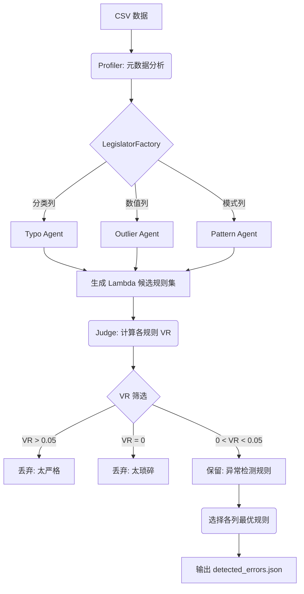

[4 tools called]

基于 `agentic_error_detector` 的代码结构和实现逻辑，我为你整理了一份详细的流程文档。这份文档涵盖了系统的核心架构、多智能体协作机制以及基于 VR（违反率）的判定逻辑。

---

# Agentic Error Detection System (智能体错误检测系统) 流程文档

## 1. 系统概述
该系统采用 **多智能体 (Multi-Agent)** 协作模式，旨在自动发现表格数据中的异常和错误。其核心思想是：**“错误是强规则下的罕见偏离”**。系统通过 LLM 生成校验规则，并利用统计学上的违反率 (Violation Rate, VR) 来筛选最能反映数据异常的“金牌规则”。

---

## 2. 核心组件
系统由四个核心模块组成：
1. **Profiler (分析器)**: 数据画像提取，识别列类型和元数据。
2. **Legislator (立法者/规则生成智能体)**: 基于 LLM 为不同类型的列生成校验规则。
3. **Judge (裁判/规则评估器)**: 计算规则的 VR 并在数据上执行校验。
4. **Main (调度器)**: 串联整个流程并输出检测报告。

---

## 3. 详细执行流程

### Step 1: 数据分析与画像 (Profiling)
`PandasProfiler` 首先对输入数据进行扫描：
- **列类型识别**: 通过启发式算法将列归类为 `categorical` (分类)、`numeric` (数值)、`pattern` (模式) 或 `text` (文本)。
- **元数据提取**: 统计空值数、唯一值分布、数值范围、字符模式（如 ZIP 代码、电话号码等）。
- **结果**: 为每一列生成一份详细的 JSON 元数据报告，供后续智能体参考。

### Step 2: 规则生成 (Rule Generation)
`LegislatorFactory` 根据列类型分派专门的智能体，通过 LLM 生成 Python `lambda` 校验函数：
- **MissingLegislator**: 针对所有列，检测缺失值。
- **TypoLegislator**: 针对分类/文本列，通过频率分析找出可能的拼写错误（如：`lambda value: str(value) in ['CorrectVal1', 'CorrectVal2']`）。
- **PatternLegislator**: 针对模式列（ID、编码），生成正则表达式校验（如：`lambda value: len(str(value)) == 5`）。
- **OutlierLegislator**: 针对数值列，根据均值和极值生成异常区间校验。
- **LogicLegislator**: 执行跨列逻辑检查（如：`离院日期 >= 入院日期`）。

### Step 3: 规则评估 (Rule Evaluation & VR Analysis)
`Judge` 模块是系统的决策核心，它对生成的上百条候选规则进行实测。
**核心逻辑 - 违反率 (VR)**:
$$VR = \frac{\text{违反规则的行数}}{\text{总行数}}$$

**判定标准**:
- **Reject Trivial (VR = 0)**: 规则太弱，所有数据都符合，无法发现错误。
- **Reject Too Strict (VR > Threshold)**: 规则太严（通常阈值为 5%），可能规则本身是错的。
- **Accept Anomaly (0 < VR <= Threshold)**: **理想规则**。它描述了大部分数据的共性，同时精准捕捉到了极少数的“偏离者”。

### Step 4: 规则选择 (Rule Selection)
对于同一列生成的多个候选规则，`Judge` 采用 **“最小非零 VR”** 策略：
- 在所有被接受（Status: accept_anomaly）的规则中，选择 VR 最小的那一个。
- 理由：VR 越小且不为 0，说明该规则定义的“共性”越强，被剔除的“异常”越罕见，准确率通常越高。

### Step 5: 错误报告与评估 (Reporting & Evaluation)
- **错误提取**: 运行选定的最佳规则，记录所有违反规则的行索引、列名和具体值。
- **基准测试 (Ground Truth)**: 如果提供清洗后的正确数据，系统会自动计算：
    - **Precision (精确率)**: 检测到的错误中有多少是真正的错误。
    - **Recall (召回率)**: 真正的错误中有多少被检测到了。
    - **F1 Score**: 综合评估。

---

## 4. 关键文件说明

| 文件名 | 职责 |
| :--- | :--- |
| `profiler.py` | 使用 Pandas 进行数据预处理和元数据提取。 |
| `legislator.py` | 封装 LLM 调用，包含各种专门规则生成 Agent 类。 |
| `judge.py` | 实现 VR 评估逻辑、规则过滤、最佳规则选择以及准确率计算。 |
| `main.py` | 程序入口，支持普通检测模式和对比基准数据的评估模式。 |

---

## 5. 流程图示 (逻辑版)

---

你可以将以上内容保存为 `README_WORKFLOW.md` 或直接更新到项目的文档中。